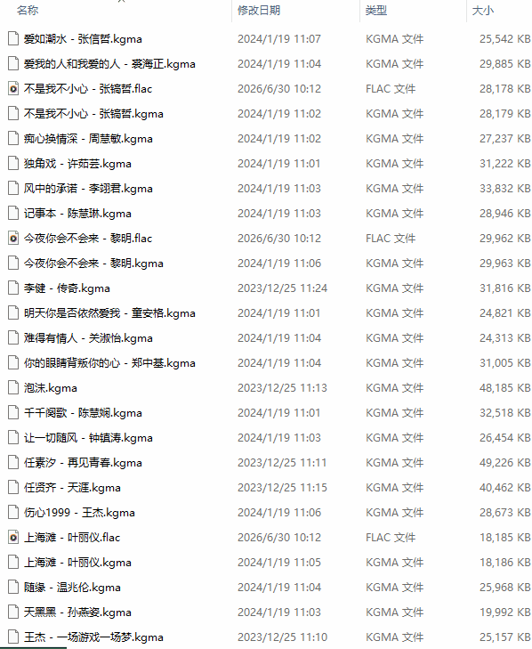

# 复制文件路径

> 选中文件后自动提取文件路径，可按配置格式化后复制到系统剪贴板

## 1. 简介

本脚本主打文件完整路径批量快速提取功能，已正式发布至「不忙脚本盒子」社区，用户在软件内检索对应脚本名称即可完成安装部署。工具支持 GUI 图形界面、命令行两种运行模式：在脚本管理面板点击条目可直接打开 GUI 配置窗口，按需个性化设置路径复制规则；依托盒子内置右键快捷执行功能，鼠标单选或批量框选文件后，便可一键把文件绝对路径复制到系统剪贴板。

适用场景覆盖命令行参数录入、项目代码路径引用、各类配置文件编写、工作文档信息登记等，大幅简化手动复制文件地址的重复操作。

## 2. 功能

| 功能     | 说明                                  |
| ------ | ----------------------------------- |
| 提取路径   | 从选中文件中提取文件路径                        |
| 引号样式   | 无引号 / 单引号 `'` / 双引号 `"`             |
| 路径分隔符  | 反斜杠 `\` / 正斜杠 `/` / 双反斜杠 `\\`       |
| 路径范围   | 完整路径 / 仅文件名                         |
| 扩展名控制  | 保留或去掉文件扩展名                          |
| 换行/分隔符 | 换行（Windows）/ 换行（Unix）/ 空格 / 逗号 / 分号 |
| 多样排序   | 按名称/修改日期/大小/扩展名排序                   |
| 升降序切换  | 支持升序和降序排列                           |
| 智能引号   | 仅当路径含空格时自动加引号                       |
| 配置 GUI | 设置窗口，可配置各项选项                        |
| 配置持久化  | 设置保存为 `config.json`，下次启动自动读取        |
| 复制到剪贴板 | 格式化后写入系统剪贴板                         |
| 完成通知   | 右下角气泡提示复制的数量                        |
| 错误容错   | 无效文件自动跳过，不影响其他文件                    |

## 3. 快速开始

- **自动安装（推荐）**
  
  - 下载 [不忙脚本盒子](https://www.bm-box.cn) 后，打开 → 脚本市场 → 搜索「复制文件路径」→ 点击安装。
  - 盒子会自动配置环境，安装后通过快捷键或右键菜单即可使用。

- **手动安装**
  
  - 需自行安装 [AutoHotkey v2](https://www.autohotkey.com/) 或更高版本。
  - 在脚本目录执行 `AutoHotkey64.exe main.ahk <参数文件路径>`。

## 4. 配置方式

### 通过 GUI 配置

通过不忙脚本盒子安装好本脚本后，在盒子中点击「复制文件路径」卡片，进入设置窗口：

- **引号样式**：无引号 / 单引号 `'` / 双引号 `"`
- **路径分隔符**：反斜杠 `\` / 正斜杠 `/` / 双反斜杠 `\\`
- **路径范围**：完整路径 / 仅文件名
- **包含扩展名**：勾选则保留扩展名，不勾选则去掉
- **换行符**：换行（Windows）/ 换行（Unix）/ 空格 / 逗号 / 分号
- **排序方式**：名称 / 修改日期 / 大小 / 扩展名
- **排序顺序**：升序 / 降序
- **智能引号**：勾选后仅当路径含空格时自动加引号

点击「保存」后配置写入 `config.json`，后续用右键获取文件路径即可自动执行该配置。

### 5. 使用方式

- **右键菜单启动**
  
  - 鼠标选中一个或多个文件/文件夹后右键，选中「复制文件路径」即可执行

- **快捷键启动**
  
  - 在盒子内为脚本自定义快捷键，选中一个或多个文件后，按下快捷键即可执行

## 6. 输出示例

选中 `D:\文档\report.txt` 和 `D:\文档\data.csv`：

| 配置               | 输出                                          |
| ---------------- | ------------------------------------------- |
| 默认               | `D:\文档\report.txt` `D:\文档\data.csv`         |
| 单引号 + 正斜杠        | `'D:/文档/report.txt'` `'D:/文档/data.csv'`     |
| 逗号 + 仅文件名        | `data.csv,report.txt`                       |
| 双引号 + 双反斜杠       | `"D:\\文档\\report.txt"` `"D:\\文档\\data.csv"` |
| 空格 + 仅文件名 + 无扩展名 | `report data`                               |

## 7. 更新日志

- v1.0.0
  
  - 首次发布（AutoHotkey v2）
  - 支持引号样式、路径分隔符、路径范围配置
  - 支持多种换行分隔符（换行/空格/逗号/分号）
  - 支持多种排序方式（名称/修改日期/大小/扩展名）
  - 支持升序/降序切换
  - 支持智能引号
  - 配置 GUI 窗口
  - 配置文件持久化（config.json）
